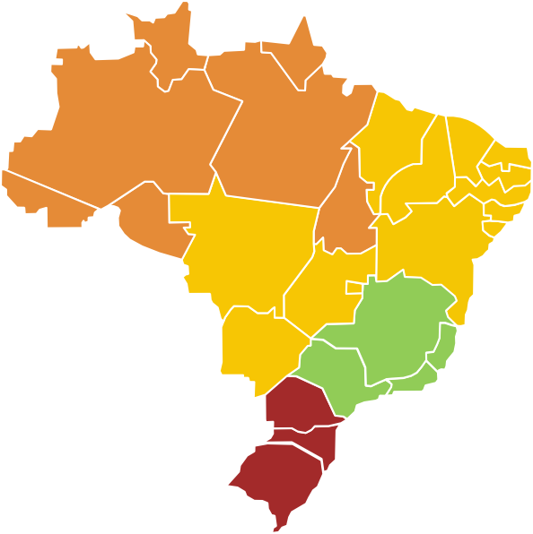

<!DOCTYPE html>
<html lang="pt-BR">
<head>
  <meta charset="UTF-8">
  <title>Sua Viagem</title>
  
</head>
<body>

  <header>
    
SUAM VIAGEM

    <nav>
      <a href="#">INÍCIO</a>
      <a href="#">SOBRE NÓS</a>
    </nav>
    

      <a href="#">CADASTRE-SE</a>
      <a href="#">LOGIN</a>
    

  </header>

  <section class="container">
    

      
      <map name="mapaBrasil">
          <area shape="poly" 
           coords="386,464,477,429,521,360,472,307,412,314,368,366,351,381,342,391,327,414"
          alt="Sudeste" title="Sudeste" href="submenu.html" target="_blank">
      </map>
    

    

      "Descubra o Brasil, um destino de cada vez. Sua próxima aventura começa aqui."
    

  </section>

</body>
</html>
